- 🔭 I’m currently working on improving my leetcode stats and a basic CRUD made using HTML, JS and CSS.
- 🌱 I’m currently learning python, JavaScript and keras.
- 👯 I’m looking to collaborate on web projects.
- ⚡ Fun fact: I enjoy helping others whenever I can. Be it in programming field or in daily life. I'm also Christian.

 
  

